# 快速开始

按照以下四个阶段完成邮箱申请、账号注册、启动器登录和客户端安装。

<NoticeBox type="info" title="开始之前">
  已申请过 @ahnu.edu.cn 邮箱的玩家，可以直接从“注册 AHNUMC Skin”开始。
</NoticeBox>

## 申请 `@ahnu.edu.cn` 邮箱

<StepList>
  <StepItem title="进入信息门户">
    
浏览器访问<a href="https://www.ahnu.edu.cn/">安徽师范大学官网</a>，点击右上角的“信息门户”。

    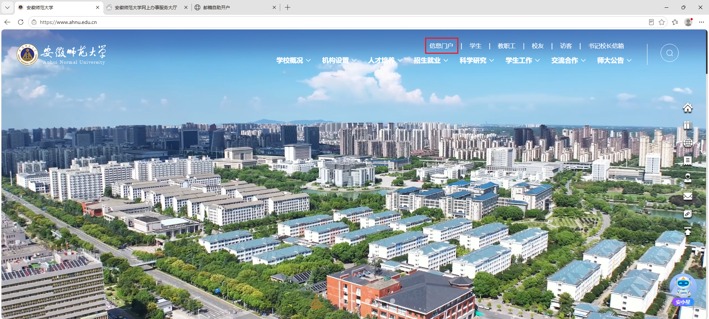
  </StepItem>

  <StepItem title="登录或激活账号">
    
使用与“今日校园”同步的账号登录。尚未注册的新生，请点击“账号激活”完成注册。

    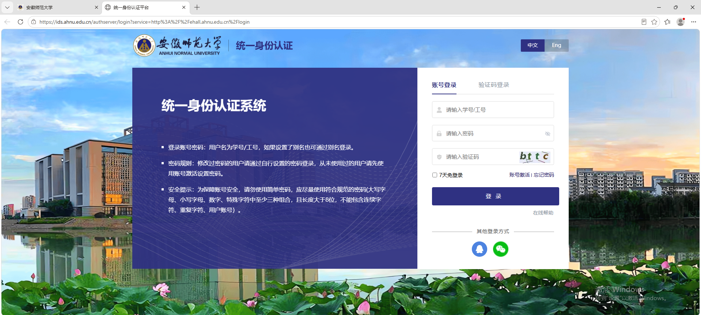
  </StepItem>

  <StepItem title="打开邮箱注册">
    
在信息门户主页进入“邮箱注册”。

    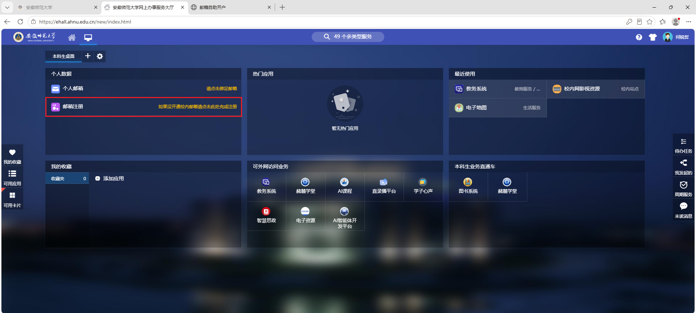
  </StepItem>

  <StepItem title="填写开户信息">
    
在邮箱自主开户页面填写相关信息。

    
<strong>请记住“帐户别名”</strong>，后续注册皮肤站时需要使用这个邮箱地址。

    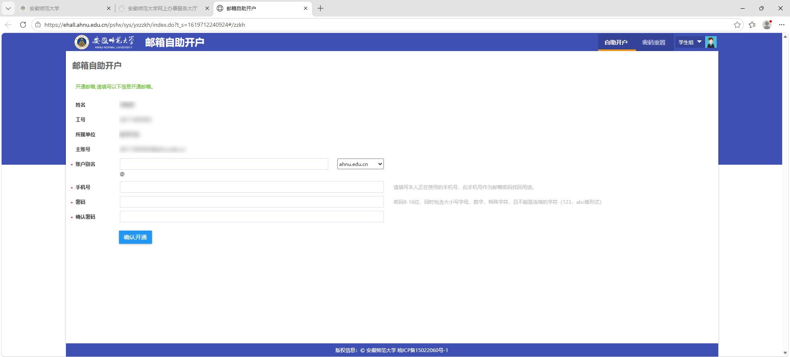
  </StepItem>

  <StepItem title="确认开通并登录">
    
确认信息无误后，依次点击“确认开通”和“登录”。

    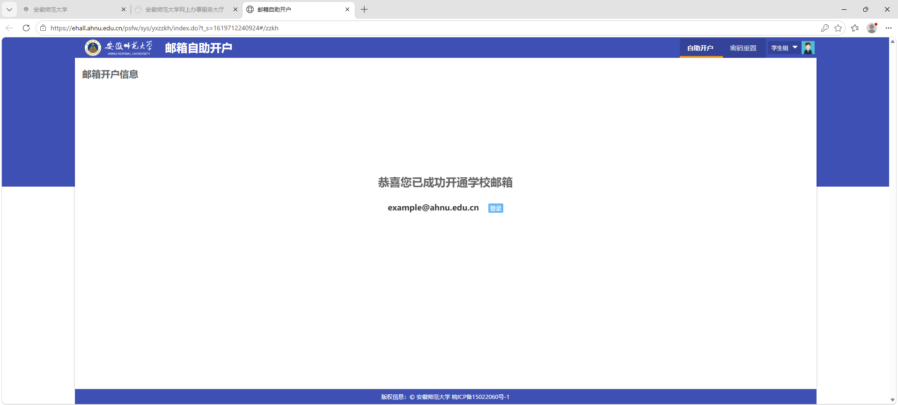
  </StepItem>

  <StepItem title="保持邮箱页面打开">
    
页面会跳转到安徽师范大学电子邮件系统。后续需要在这里查收验证邮件，请暂时不要关闭。

    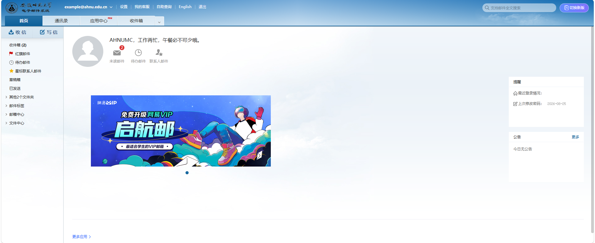
  </StepItem>
</StepList>

## 注册 AHNUMC Skin

`AHNUMC Skin` 是 AHNUMC 开发组为玩家提供的皮肤站，可用于启动器认证、修改皮肤和查看游戏数据。

<StepList>
  <StepItem title="打开注册页面">
    
浏览器访问 <a href="https://skin.ahnumc.org/">AHNUMC Skin</a>，点击“注册”。

    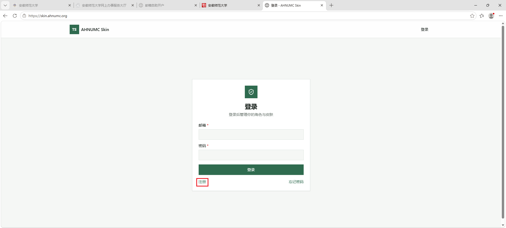
  </StepItem>

  <StepItem title="提交注册信息">
    
邮箱填写刚刚申请的 <code>@ahnu.edu.cn</code> 地址，完成后点击“注册并发送验证邮件”。

    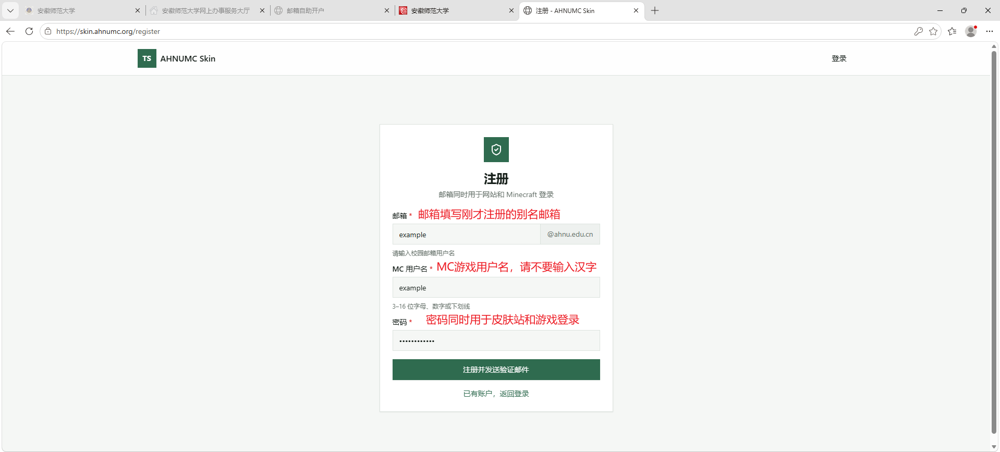
  </StepItem>

  <StepItem title="查收验证邮件">
    
返回学校邮箱并打开 AHNUMC Skin 发来的验证邮件。

    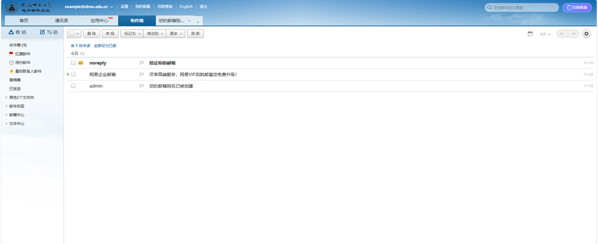
  </StepItem>

  <StepItem title="打开验证链接">
    
点击邮件中的验证链接，在浏览器中继续验证。

    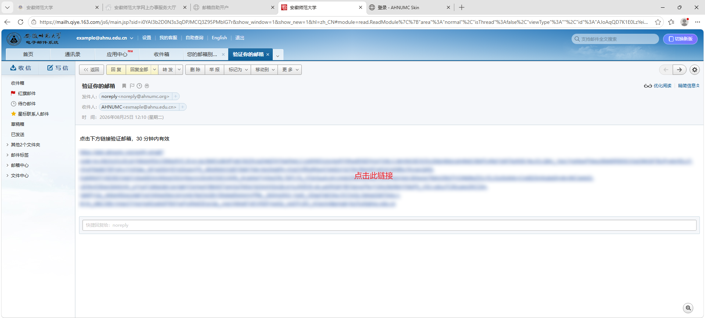
  </StepItem>

  <StepItem title="确认邮箱验证">
    
按页面提示完成邮箱验证。

    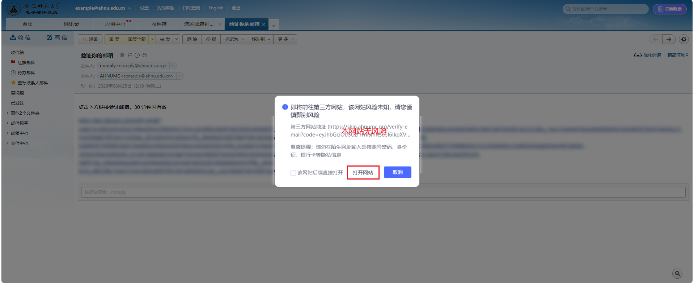
  </StepItem>

  <StepItem title="完成账号注册">
    
页面显示验证成功后，AHNUMC Skin 账号即可使用。

    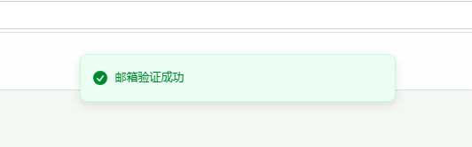
  </StepItem>
</StepList>

## 登录 AHNUMCL

<StepList>
  <StepItem title="下载启动器">
    
从群文件下载 AHNUMCL。

    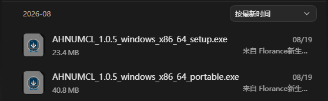
  </StepItem>

  <StepItem title="选择分发版本">
    
文件名以 <code>setup</code> 结尾的是安装包，以 <code>portable</code> 结尾的是便携版。推荐下载便携版。

    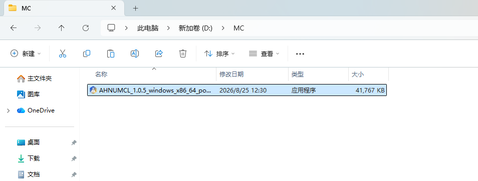
  </StepItem>

  <StepItem title="解压到独立文件夹">
    
将下载的程序放入一个独立文件夹，再运行启动器。

    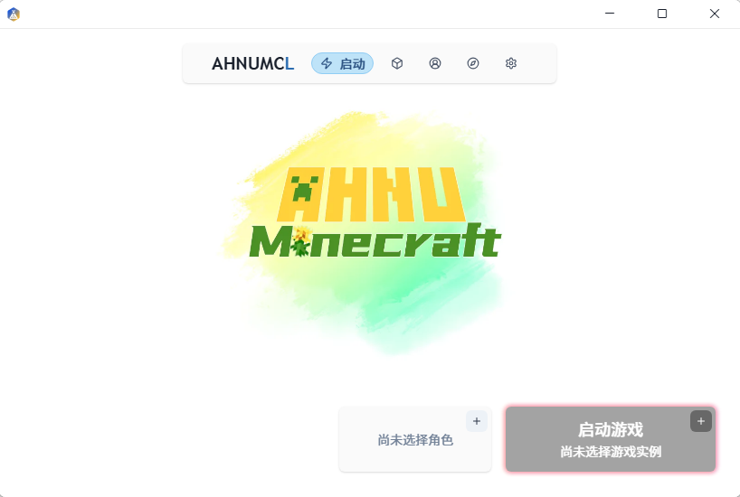
  </StepItem>

  <StepItem title="进入用户页面">
    
点击顶栏的用户图标。

    
    
进入用户页面后，在侧边栏选择“AHNUMC Skin”。

    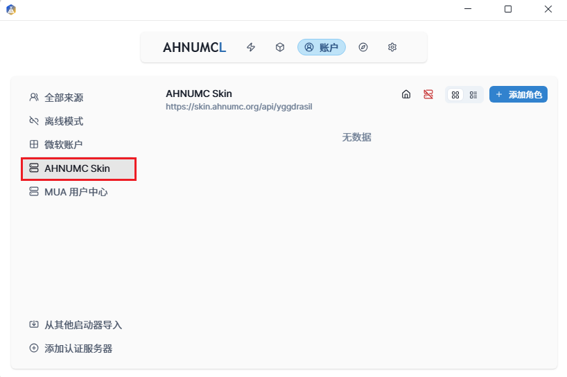
  </StepItem>

  <StepItem title="添加角色">
    
点击右上角的“添加角色”。

    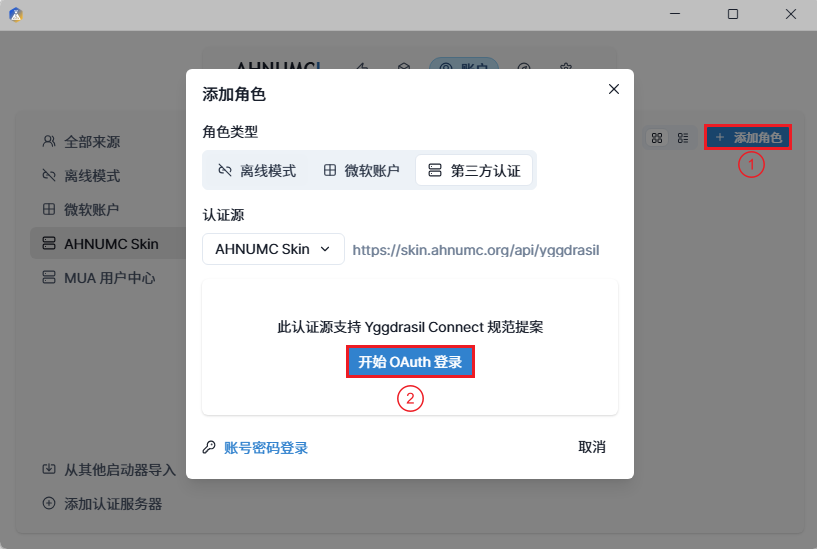
  </StepItem>

  <StepItem title="开始 OAuth 登录">
    
在添加角色页面依次点击“开始 OAuth 登录”和“继续登录”。

    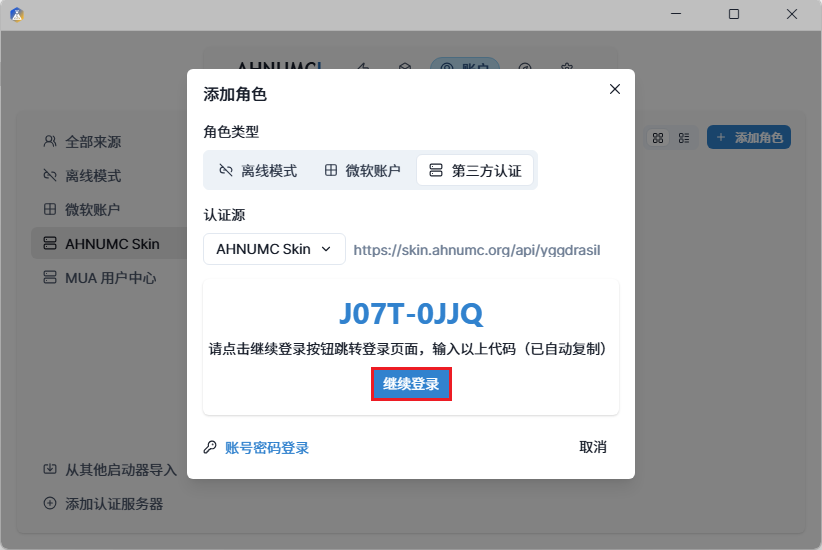
  </StepItem>

  <StepItem title="授权启动器登录">
    
浏览器会打开“启动器登录授权”页面。确认当前登录的是自己的 AHNUMC Skin 账号后完成授权。

    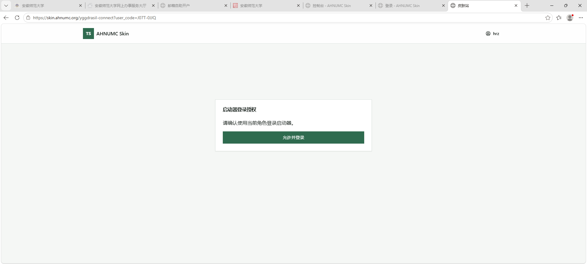
  </StepItem>

  <StepItem title="返回启动器">
    
页面显示授权完成后返回 AHNUMCL，此时账号登录成功。

    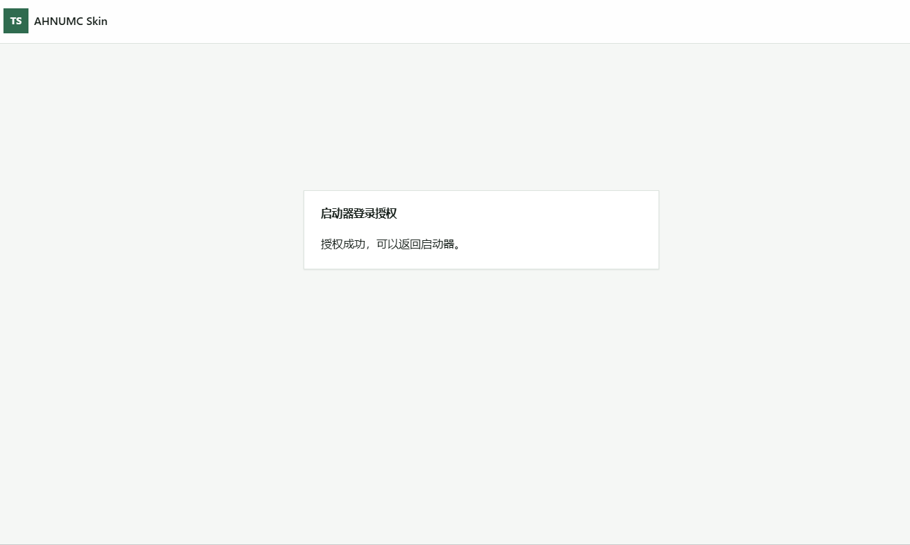
  </StepItem>
</StepList>

## 下载 AHNUMC 整合包/客户端

<StepList>
  <StepItem title="进入发现页">
    
在 AHNUMCL 顶栏点击“发现”图标。

    
    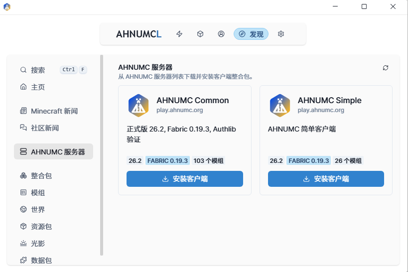
  </StepItem>

  <StepItem title="选择 AHNUMC Common">
    
找到并安装 <code>AHNUMC Common</code> 客户端。

    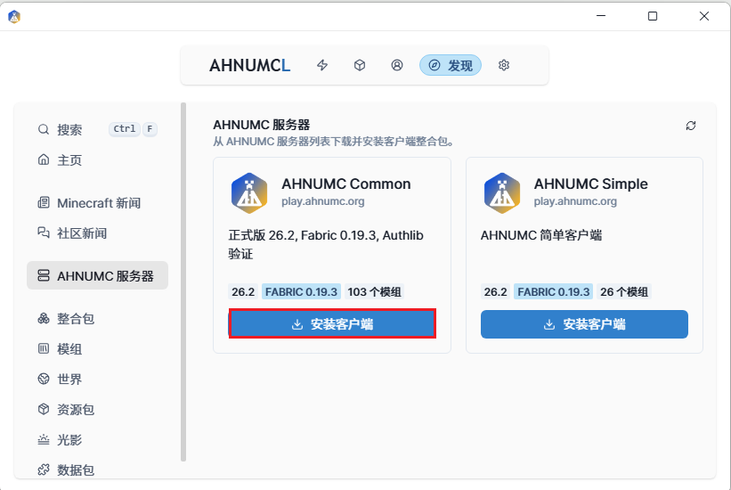
  </StepItem>

  <StepItem title="导入整合包">
    
下载完成后会显示“导入整合包”页面。点击“导入”，然后等待处理完成。

    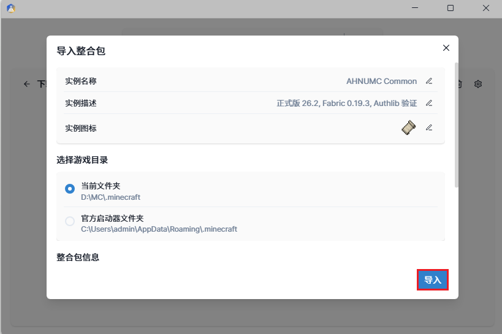
  </StepItem>

  <StepItem title="等待下载任务完成">
    
保持启动器运行，直到所有下载任务结束。

    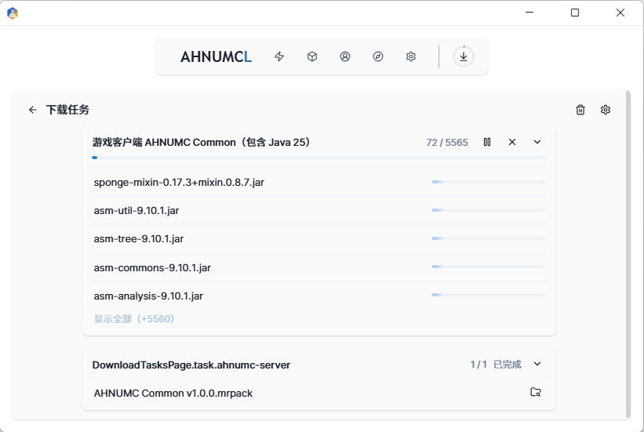
  </StepItem>

  <StepItem title="启动游戏">
    
返回实例页面启动游戏，即可进入 AHNUMC。

    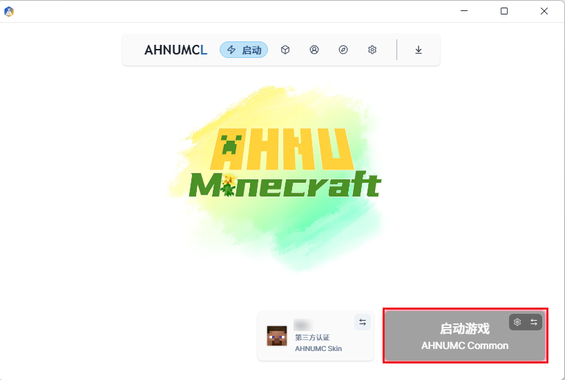
  </StepItem>
</StepList>

<NoticeBox type="success" title="准备完成">
  启动器已登录且客户端安装完成。后续更新可直接在 AHNUMCL 中进行。
</NoticeBox>
