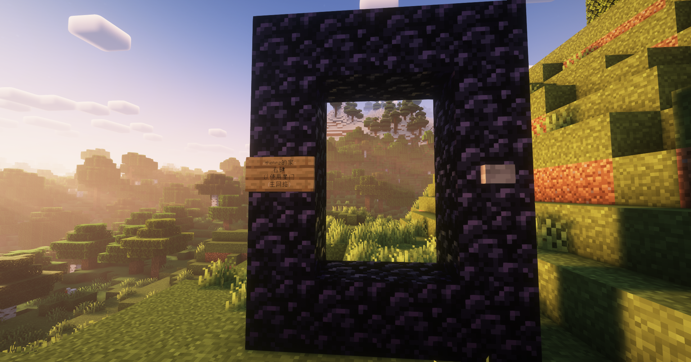
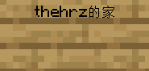
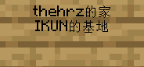
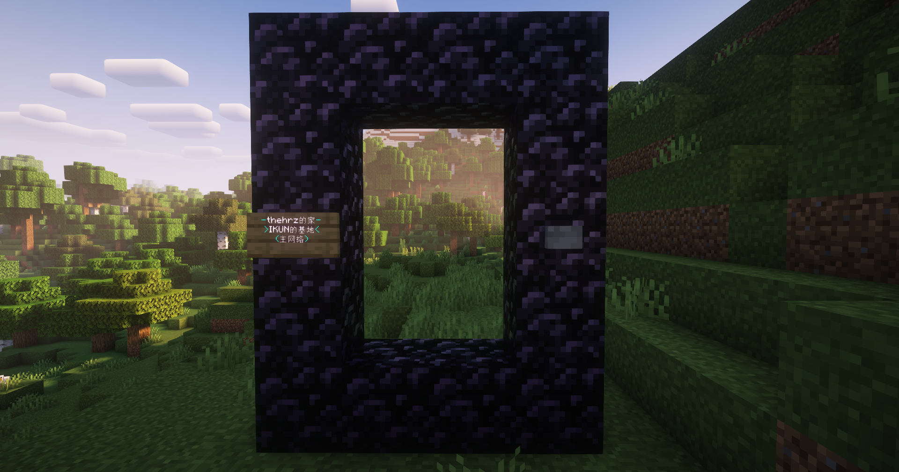

# 星门 (Stargate)

> 它是有史以来最可定制的交通插件之一，并且在设计时考虑了最终用户的创作！ ——原作者

Stargate 是一个经典的传送插件，它允许在远距离之间甚至跨服务器之间进行即时传送。

## 设置星门

基础星门星门使用铁块、告示牌、按钮来组成，其中按钮会在告示牌设置星门数据完毕后自动生成。

设置星门需要500硬币，使用一次需要25硬币。

## 星门参数

在搭建好星门并且放下告示牌后，你需要正确填写告示牌内容才能创建星门。创建后不能再次修改，因此请确定你所填写的参数无误后再进行创建。

### 第一行：星门名称

第一行为你的星门名称，注意无法使用重复的星门名字。

最简单的星门只需填写此行。

### 第二行：目标星门名称[可选]

第二行可以填写你想要链接到的指定星门名称，如果填写，则该星门始终链接到指定的星门。

一个从thehrz的家连通到IKUN的基地的定向星门。

### 第三行：星门网络[可选]

不同的星门网络互相独立，且每个网络都有自己专属的网络名称。一个星门只能前往同一网络中的其他星门。

如果在创建时未指定目标星门也未指定星门网络，则该星门会默认链接到`主网络`网络。

### 第四行：额外参数[可选]

额外参数可以调整星门的具体设置，详细如下：

| 标记 | 描述                                                         |
| ---- | ------------------------------------------------------------ |
| h    | 隐藏标记，被标记为隐藏的星门不会在网络列表中和卫星地图里显示 |
| p    | 私有标记，被标记为私有的星门只能被其创建者使用               |
| b    | 反向标记，被标记为反向的星门玩家传送面向星门后 |
| r    | 随机标记，随机星门会随机选择一个可用的目的星门前往           |
| a    | 始终开启，被标记的星门始终开启（必须为定向星门）             |

## 颜色与格式

在完成星门创建后，你可以使用染料来修改星门的告示牌，使用染料右键即可进行修改。
